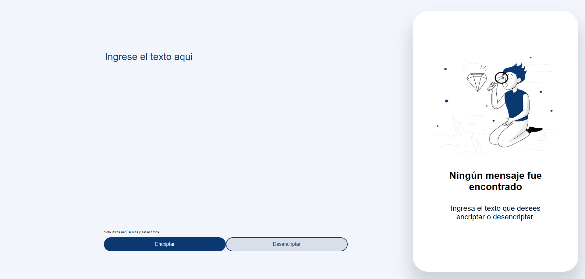
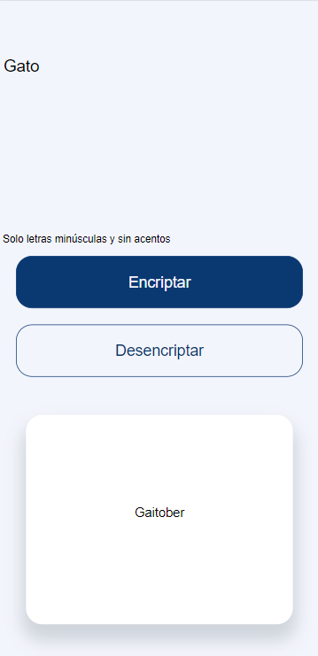

# Encriptador de texto - Oracle ONE Challenge

## Descripción

Este proyecto consiste en desarrollar una aplicación web utilizando los conocimientos aprendidos en el módulo "Principiante en programación" del curso de Oracle Next Generation.

Vista de escritorio:

Esta aplicación funciona como un encriptador de texto. Las "llaves" de encriptación son las siguientes:

* La letra "e" es reemplazada por "enter"
* La letra "i" es reemplazada por "imes"
* La letra "a" es reemplazada por "ai"
* La letra "o" es reemplazada por "ober"
* La letra "u" es reemplazada por "ufat"

### Ejemplo:
"gato" => "gaitober"
"gaitober" => "gato"

Vista para dispositivo móvil:

### Notas:
* Funciona solo con letras minúsculas.
* No encripta letras con acentos ni caracteres especiales.

El diseño del front end se hizo a partir de este [diseño en figma](https://www.figma.com/design/trP3p5nEh7XUyB3n2bomjP/Alura-Challenge---Desaf%C3%ADo-1---L%C3%B3gica?node-id=0-1&t=J3eaw8cZjFaQHPC0-0).

## Live Demo

Puedes ver el [live demo aquí](https://kuawi.github.io/Encriptador-ONE/)

## 📝 Licencia

El código de este proyecto puede ser utilizado bajo la licencia [MIT](https://github.com/kuawi/Encriptador-ONE/blob/main/LICENSE).